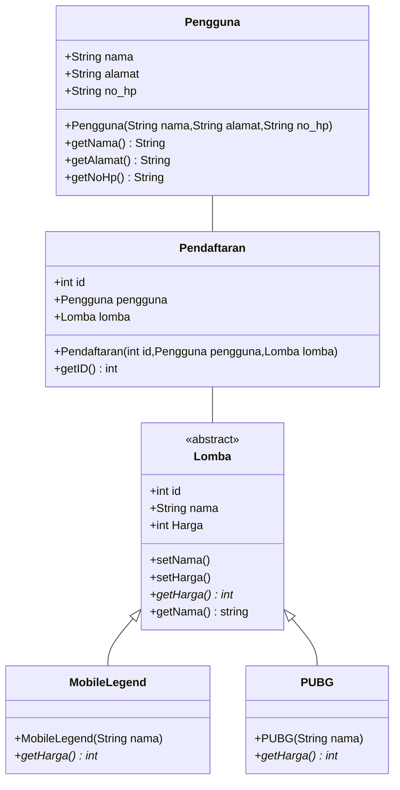
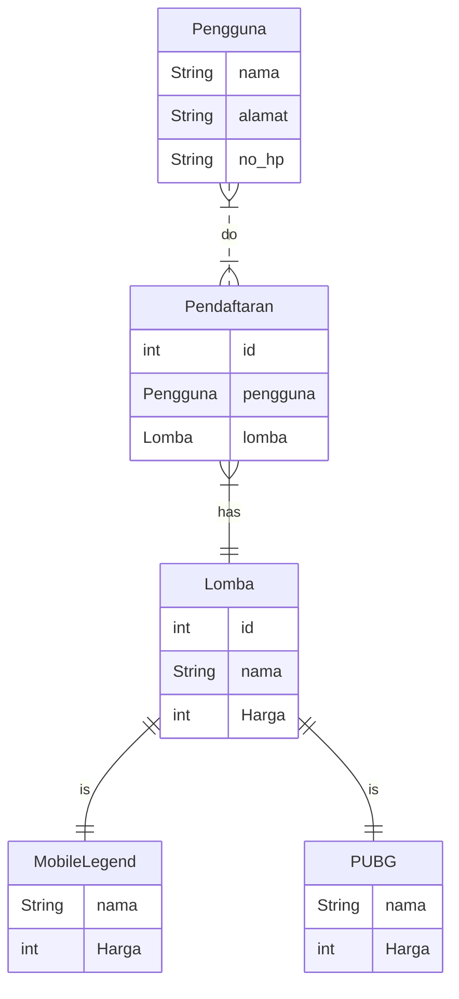
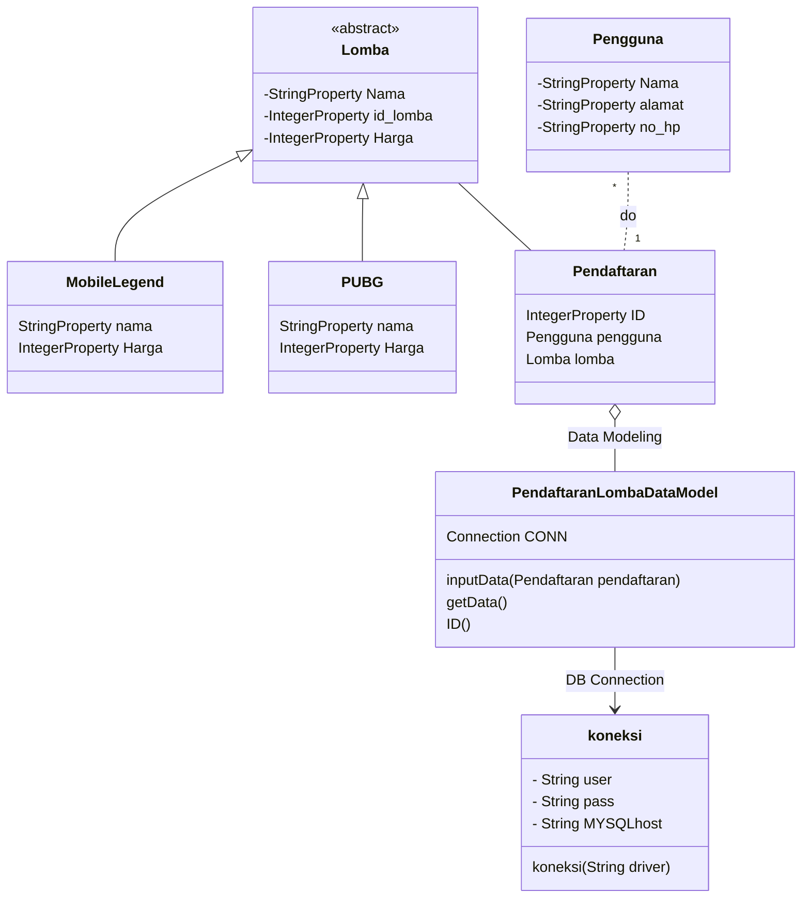

# Final Project PBO

'SI Pendaftaran Lomba' merupakan Sistem Informasi yang dapat digunakan untuk menginput data Pendaftaran Lomba yang dikhususkan untuk Lomba e-Sport terutama Mobile Legend dan PUBG Mobile di Lampung.

M.Fadhil Hakim 1957051014
Devi Ramadhia Fitri 1917051005
Sendy Pramita 1917051030

Untuk pembagian tugas Final Project dikerjakan bersama-sama

### Class Diagram

### ER Diagram

### Design Class Diagram for JavaFX and Database

Link Youtube : penjelasan
